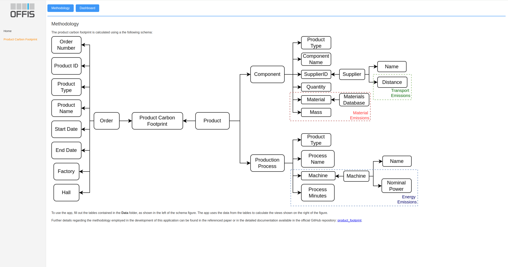

# Container-Based Micro-Services Application for Product Carbon Footprint Calculation

This repository hosts the source code for a Container-based micro-services application designed to facilitate the calculation of product carbon footprints for manufacturing companies. Developed as an artifact for the paper "Container-Based Micro-Services Application for Product Carbon Footprint Calculation in Manufacturing Companies," this application aims to provide a scalable and efficient solution for assessing the environmental impact of manufacturing processes.

*Key Features:*

- Microservices Architecture: Utilizes a modular architecture with Docker containers for scalability and ease of deployment.

- Database Integration: Implements a database schema to store product and material information essential for carbon footprint calculation.

- Calculation Algorithms: Incorporates algorithms to compute carbon footprints based on material, energy and transport emissions..

- User Interface: Provides a user-friendly interface for interacting with the application and viewing carbon footprint results.

- Documentation: Includes comprehensive documentation outlining the methodology, setup instructions, and usage guidelines.

- Regulatory Compliance: Designed to comply with regulations such as the Corporate Sustainability Reporting Directive (CSRD), ISO 14067, ISO14040 and other relevant standards.

*Contributing:*

Contributions to this project are welcome! Whether you're interested in adding new features, fixing bugs, or improving documentation, feel free to fork the repository and submit pull requests. Please refer to the contribution guidelines for more information.

For more information, please refer to the documentation and the referenced paper.

## Usage Guidelines

### Building the Project - Example Use Case
Make sure you have Docker installed

After cloning the repository, run: 

`docker-compose up --build` 

This should build the images for the database, dashboard and website (platform). 

You can access the website at localhost port 4200.

It may not be necessary, but if you need to access the database and dashboard, the credentials are included in the docker-compose.yml.

### Building your own example

Before building and running, populate the tables in _./data_ with your own data. 

- Download the appropiate energy generation data from *https://www.smard.de/* and save it in energy_smard.csv.
- Adjust the emission factors for the materials using ProBas, Ecoinvent or similar databases. In our case, we used Ecoinvent.

Make sure not to alter the table structure. The application will create the database using your data

Run `docker-compose up --build`

The application will read the data from the database and create the respective dashboards and website.

Access them also at localhost port 4200.

